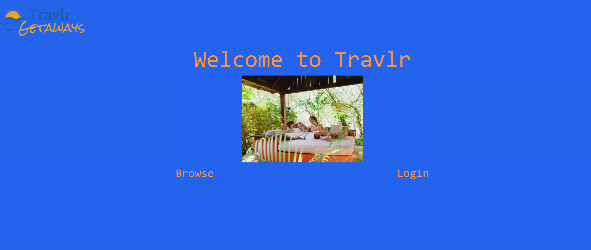
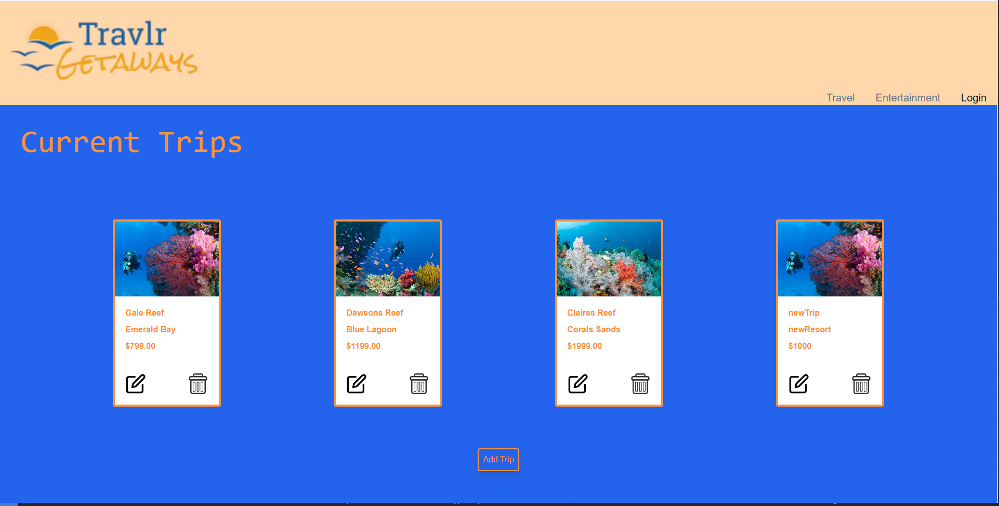
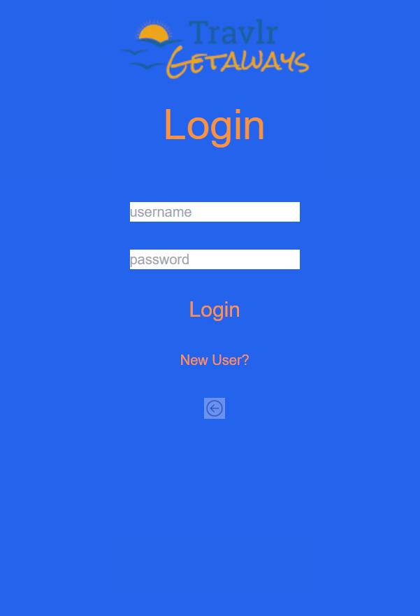
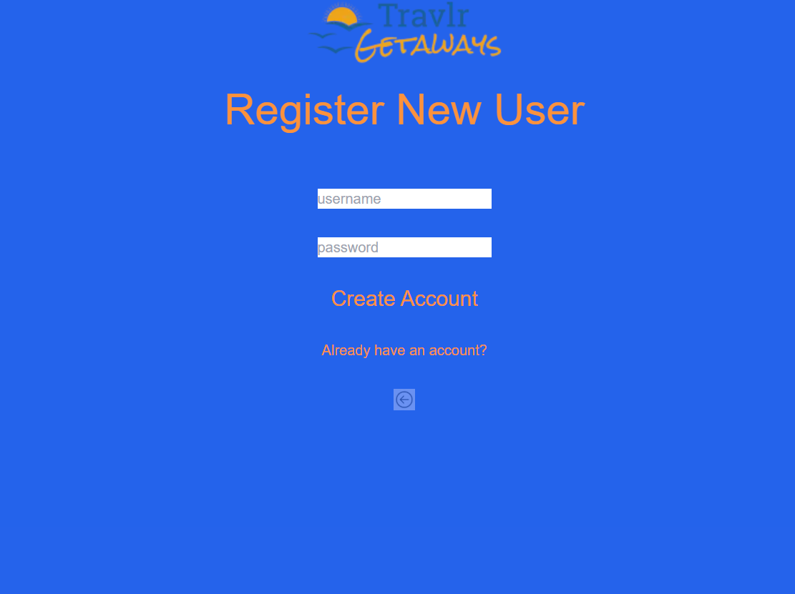

# Software Design and Engineering: Traveler (NextJS)  
  
  
  
  

## Description

This application was originally created in Full-Stack Development 1 in my computer science program at SNHU. It allowed me to learn the process of converting traditional html webpages into dynamic single-page applications. The Traveler final project that was submitted was a MERN stack application. MongoDB was implemented for storage of the trips as well as users within the system that would need login permission for administrative purposes. For the software design and engineering area, however, I did want to focus more on the integration of NextJS. The enhancements for this application aimed to provide users with a friendly dashboard from which it could be navigated and CRUD methodology easily utilized. By taking advantage of tools within NextJS it is easy to create modular and reusable code for an application. In turn this also allows for fast loading times, due to compiling all pages upon originally accessing the webpage. A responsive and lightweight application is exceedingly popular in terms of modern web architecture, where the goal is to be efficient and minimize excess. Server-side conditional calling and caching within NextJS amplifies the benefits already mentioned and gives developers an even greater level of control over the operation of a NextJS application. 

## Goals

The goals of enhancements for this application revolved around the implementation of current and different technologies. There are many frameworks that exist within the industry and are constantly involving. I wanted to provide myself with a challenge and opted for reimagining this application with a different stack. NextJS is a very current version of react, which is the framework I had previously utilized in my time at full-stack development bootcamp. However, NextJS had taken some of these previous concepts, similarly shared by Angular, and implemented further changes to the dynamic of the framework. SPAs provide the most dynamic user experience and a fast-loading and flexible application. By also integrating TailwindCSS for the styling of the react components and pages, I can implement inline styling like 3rd party libraries such as Bootstrap or Material-UI. By implementing dynamic and user-central ideology in this application's design, it is reactive and mobile-friendly. This strongly embodies the traits that a Software Design and Engineering artifact should embody. Below I have provided a list of enhancements performed to create this application. 

  
<ul>
  <li>Implement NextJS framework</li>
  <li>Complete learning courses by Vercel in NextJS</li>
  <li>Use built-in font and inline stylings of TailwindCSS</li>
  <li>Implement intelligent routing through NextJS routing</li>
  <li>Design reusable components to utilize in application pages</li>
  <li>Implement file structure and naming conventions in line with best practices</li>
  <li>Integrate new versions of web pages in NextJS</li>
  <li>Add comment headings and in-line commenting to further expand on the functionality of the different files,componenets, and constructed methods</li>
</ul>

## Reflection

There were many challenges approaching this technology. Experience in MySQL and React gave me some background in this framework, but there have been many changes in the version of React. Integrations with the backend proved different than traditional express servers to run the application on. By utilizing cloud services, the application can run serverless through Vercel's platform. Rendering components was also a learning process. NextJS utilizes server and client components that you must specifically denote in the construction of the pages that NextJS utilizes for routing purposes. However, I spent a lot of time in the docs and completing lessons involving utilization of this service. This process was extremely rewarding, and I want to expand upon the knowledge that I have gained through implementing this new and current technology within the industry. 
   
This project demonstrates employing strategies for building collaborative environments that enable diverse audiences to support organizational decision making in the field of computer science. This is achieved through using headers for files describing their functionality and describing functionality within the codebase. By providing clear naming conventions and commented description within the codebase itself, the codebase is easily readable and understandable. This also highlights my ability to create positive code-review experiences individually and within a team environment. Utilizing the framework NextJS I can implement smart routing through the use of folders and page.tsx files within the app section of the application. This allows for easily navigable and legible code. Storing logic files in separate typescript files allows for defined logic to be performed on sever-components within the application. 
   
The enhancements to this project also demonstrate my ability to design, develop, and deliver professional-quality oral, written, and visual communications that are coherent, technically sound, and appropriately adapted to specific audiences and contexts. By explaining and expanding on functionality of the codebase commenting and naming conventions I demonstrate the ability to clearly convey ideas and communicate appropriately to specific audiences. This also showcases the ability to communicate a code review effectively. Modularized code that follows best practices in terms of naming conventions and structure provides a very intuitive manner of examining codebase for review in a team or formal setting as well as suitable for presenting to shareholders or other company figures. By allocating header space on files to explain their functionality and then further walk users through the logic below I can integrate others into the application with ease knowing that my code is properly explained, and files or folders are named in-line with standard best practices to provide further clarity of the work. 
  
The enhancements to this project demonstrate an ability to use well-founded and innovative techniques, skills, and tools in computing practices for the purpose of implementing computer solutions that deliver value and accomplish industry-specific goals. Best practices are transparent in the application. Proper usage of NextJS allows for modularization of codebase and ability to reuse code that is constantly prevalent in the application. By also implementing frameworks for future functionality in the application and explanation in the header section of files I can articulate phases within the software development lifestyle and plans for implementation of future technology and methods within the application. NextJS and dynamic frameworks are prevalent in current web development standards. The industry has shifted away from traditional webpage designs into more lightweight versions that are more responsive, perform logic quicker, and have scalability in the user interface for different device usage. Tools such as NextJS with Vercel's Postgres implementations allow for innovative techniques and skills to deliver value and accomplish industry-specific goals. 
   
I aim to expand further upon this application and implment additional functionality with future releases

# Contributors
Jesse Draper (Myself)

